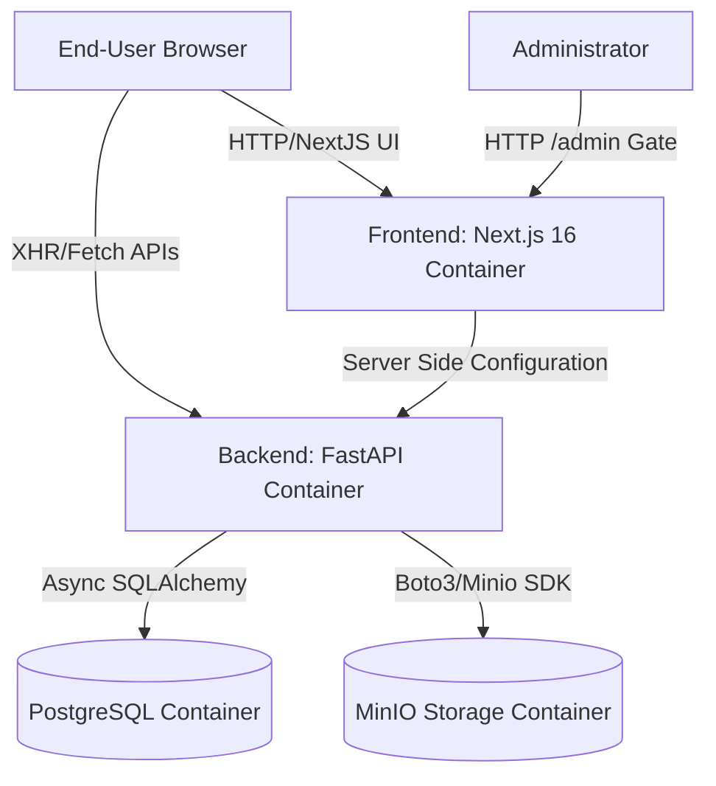
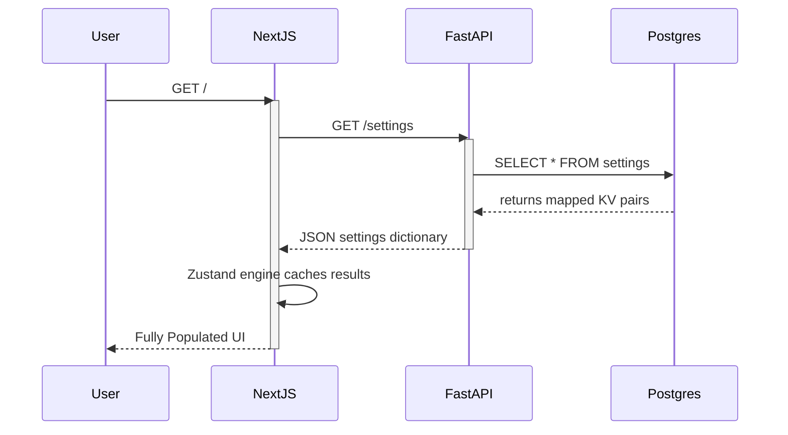

# EMF Fitness: High-Level Design (HLD)

## 1. System Architecture Overview

The EMF Fitness platform is a decoupled, container-native web application designed to support high-conversion personal training acquisition and dynamic content management.

### Component Diagram

## 2. Infrastructure Technologies

* **Frontend Container**: Renders React using Turbopack inside a Node 18 environment. State architecture depends heavily on a singleton `Zustand` engine allowing dynamic text generation without excessive prop-drilling or NextJS UI jumps. 
* **Backend Container**: An ASGI Python 3.11 environment utilizing `uvicorn`. Connects to external services via async connection pools.
* **Database Container**: Standard PostgreSQL isolated volume natively mapped to Alembic migrations maintaining structured relational dependencies.
* **Storage Container**: An S3-Compatible MinIO bucket handling heavy media objects (Videos, Before/After photos, Diet PDFs).

## 3. Data Flow: Rendering Content

1. End User queries `http://localhost:3000`.
2. Next.js natively renders the DOM hierarchy. The internal `CMSLoader.tsx` mounts and issues an async HTTP request to `FastAPI:/settings`.
3. FastAPI queries PostgreSQL for the global configuration JSON properties.
4. FastAPI passes the response body back to `Zustand`.
5. Zustand rapidly triggers React DOM updates populating the `About`, `Footer`, `Hero`, and `Services` components instantly.

