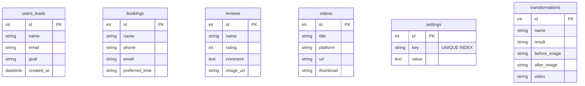
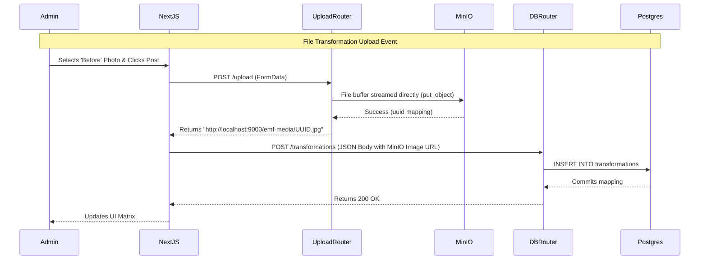

# EMF Fitness: Low-Level Design (LLD)

## 1. Database Schema (PostgreSQL)

The Relational Schema isolates the entities mapped via SQLAlchemy ORMs.

## 2. Admin Media Processing Workflow

When an Administrator uploads a transformation photo through the CMS, a dual-pipeline strategy resolves the object storage securely.

## 3. Frontend Component Topologies

### Global Store
* `store/cmsStore.ts`: Leverages `Zustand`. Holds the `settings` Record object. Orchestrates data deduplication.

### Core Architecture Components
1. **CMSLoader.tsx**: An invisible component attached into `page.tsx` solely to trigger the global hook async execution natively outside of Server Components constraint.
2. **Transformations.tsx**: Intercepts `objectFit` parameters allowing NextJS Native Image engines to dynamically restrict box-sizing natively mapping to `100vw`.
3. **admin/page.tsx**: Refactored strictly into a massive ternary-operator based Tabbed UI interface protecting API execution behind the `EMF2026` React State memory boundary.

### Native APIs Exposed
* `GET /transformations`: Resolves array of Transformation entries.
* `POST /transformations`: Secure object generation.
* `GET /settings`: Yields exact layout KV strings natively digested by the frontend store.
* `POST /settings`: Aggressive loop upsert mechanism for global application layouts.
